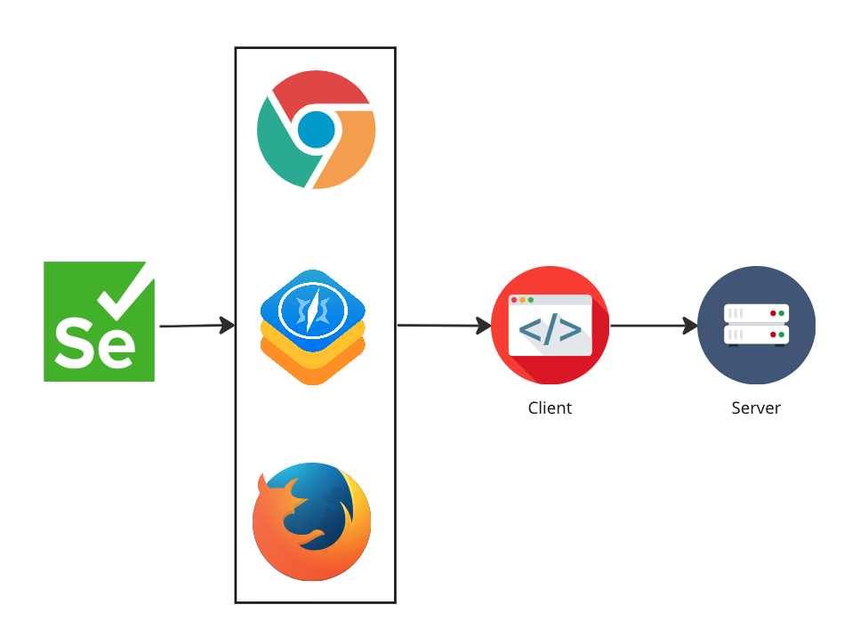
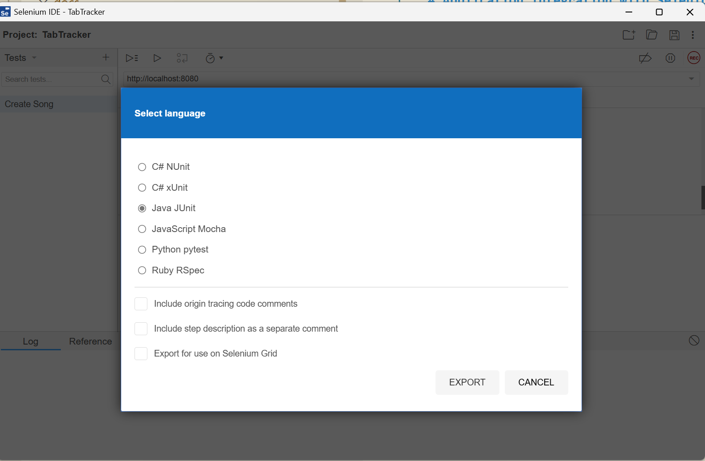

# Application Integration with Selenium and Java

Up until now, we used a simple Selenium test that navigated to a public website.  
In a real-world scenario, you typically want to test your own application.

In this exercise, you'll learn how to integrate Selenium with a real web application running locally.

## The Application

We will use a music tracker app consisting of:
- A **server** (API) that communicates with a database
- A **client** (web frontend) built with Vue.js

We’ll focus on writing Selenium tests for the frontend (client).



## Exercise: Starting the Client & Server

This app uses a Node.js + Vue.js stack. Make sure you have **Node.js** and **npm** installed. (Exercise: **0. Getting started**)

### Step 1: Start the Server

```bash
cd server
npm install
npm start
```

This should start the backend server at:  
`http://localhost:8081`

### Step 2: Start the Client

In a second terminal:

```bash
cd client
npm install
npm start
```

This should start the frontend at:  
`http://localhost:8080`

Open this URL in your browser and verify the app is running.

## Exercise: Recording a First Test (Selenium IDE)

Selenium IDE allows you to record user interactions and export them as Java test code.

1. Install Selenium IDE for your browser:
   - Chrome: [Selenium IDE Chrome Extension](https://chrome.google.com/webstore/detail/selenium-ide/mooikfkahbdckldjjndioackbalphokd) (recommended)
   - Firefox: [Selenium IDE Firefox Add-on](https://addons.mozilla.org/en-US/firefox/addon/selenium-ide/)
2. Click `Create New Project`
3. Set `http://localhost:8080` as your starting URL
4. Record some actions:
   - Click a button
   - Enter a value
   - Submit a form
5. Stop recording and export as:
   - **Language**: Java
   - **Test Framework**: JUnit
   
6. Save the `.java` file to your IntelliJ project:  
   `src/test/java`
   > **Warning**: Selenium IDE exports in the JUnit 4 format. But we use the newer, JUnit 5 version. You need to remove the imports, change `@Before` to `@BeforeEach`, change `@After` to `@AfterEach` and manually add the imports again. 

7. Run the test using IntelliJ's green Run button

## Exercise: Clean up your test

Now that the test runs, try to:

- Remove duplicate code (e.g., repeated navigations)
- Extract common setup logic to a helper method or `@BeforeEach`
- Ensure the test is fast and reliable

This will improve maintainability and test clarity.

## Summary

You’ve now integrated your Selenium test suite with a real local web application.  
You learned how to:
- Run the app locally
- Record browser actions with Selenium IDE
- Clean and optimize test code

👉 Next up: we’ll explore how **reporting** inJUnit works. 