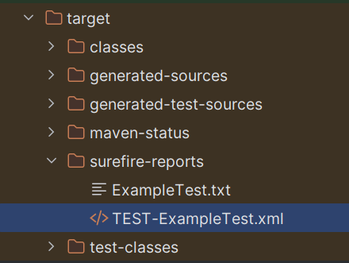

# Reporting in Selenium with JUnit

Once your Selenium tests have run, you usually want to collect and store the test results — either for review, reporting, or integration into a CI/CD pipeline.

JUnit 5 provides built-in support for generating test results in **XML format**, which can be processed by many tools such as **Jenkins**, **GitLab CI**, or imported into **Xray** for **Jira** test management.

---

## JUnit XML Reports

When you run your tests using Maven, JUnit automatically generates **XML test reports** under the following directory:

```
target/surefire-reports/
```

For each test class, you will find a file like:

```
TEST-org.selenium.training.ExampleTest.xml
```

This file contains structured information about each test run — especially useful for CI/CD pipelines, dashboards, or test result parsers.



### 📄 Example Content Explained

```xml
<testsuite name="org.selenium.training.ExampleTest" tests="1" failures="0" skipped="0">
  <testcase classname="org.selenium.training.ExampleTest" name="openXebiaWebsite" time="2.345"/>
</testsuite>
```

Let’s break this down:

#### `<testsuite ... >`

| Attribute     | Meaning                                                                 |
|---------------|-------------------------------------------------------------------------|
| `name`        | The fully-qualified name of the test class                              |
| `tests`       | Total number of test methods in this class                              |
| `failures`    | Number of failed tests (with assertions or exceptions)                  |
| `skipped`     | Number of tests skipped (e.g. via conditions, `@Disabled`, etc.)        |

---

#### `<testcase ... >`

| Attribute     | Meaning                                                                 |
|---------------|-------------------------------------------------------------------------|
| `classname`   | The class that contains the test method                                 |
| `name`        | The name of the test method (e.g. `@Test openXebiaWebsite()`)           |
| `time`        | How long the test took to run (in seconds) — `2.345` = 2.345s           |

---

### ✅ Example: Passed Test

```xml
<testcase classname="MyTest" name="testLoginSuccess" time="0.873"/>
```

No `<failure>` or `<error>` tag → test passed.

---

### ❌ Example: Failed Test

```xml
<testcase classname="MyTest" name="testLoginFails" time="0.501">
  <failure message="expected: 200 but was: 403" type="AssertionError">
    AssertionFailedError: expected: 200 but was: 403
  </failure>
</testcase>
```

This indicates a failed assertion.  
You get:
- `message`: short explanation
- `type`: the exception type
- inner content: full message or stack trace

---

### 🤷‍♂️ Example: Skipped Test

```xml
<testcase classname="MyTest" name="testFeatureNotReady" time="0.000">
  <skipped/>
</testcase>
```

Usually the result of `@Disabled` or conditional skipping.

## Exercise: Installing Maven Locally (Windows & macOS)

As we need to run the `mvn`-command in our console, we first need to install **Apache Maven** locally. If the `mvn`-command already loads on your machine, you can skip this exercise.

The now explained installation process is based on [this official](https://maven.apache.org/install.html) one.

### ✅ Step 1: Download Maven

This guide helps you install **Maven** locally and set the required `PATH` environment variable.

Go to the official download page:

🔗 [https://maven.apache.org/download.cgi](https://maven.apache.org/download.cgi)

- Download the latest **binary zip archive** (e.g., `apache-maven-3.9.6-bin.zip` or `.tar.gz` for macOS)

---

### 🪟 Windows Installation

#### 1. Extract

Unzip the downloaded file, e.g. to:

```
C:\Program Files\Apache\apache-maven-3.9.6
```

#### 2. Set Environment Variables

##### Option A: Permanent (System-wide)

1. Open **System Properties** → **Advanced** → **Environment Variables**
2. Under "System Variables", click **New**:
   - Name: `MAVEN_HOME`
   - Value: `C:\Program Files\Apache\apache-maven-3.9.6`

3. Find the `Path` variable → click **Edit** → Add:

```
%MAVEN_HOME%\bin
```

4. Click OK and restart your terminal

#### 3. Verify

Open `cmd.exe` and run:

```cmd
mvn -v
```

---

### 🍏 macOS Installation

#### 1. Extract and move

Open Terminal and extract the `.tar.gz` file:

```bash
tar -xvf apache-maven-3.9.6-bin.tar.gz
sudo mv apache-maven-3.9.6 /opt/apache-maven
```

#### 2. Set Environment Variables

Edit your shell config (`~/.zshrc`, `~/.bash_profile`, or `~/.bashrc`) and add:

```bash
export MAVEN_HOME=/opt/apache-maven
export PATH=$MAVEN_HOME/bin:$PATH
```

Apply the changes:

```bash
source ~/.zshrc  # or your appropriate shell config
```

#### 3. Verify

```bash
mvn -v
```

You should see Maven's version and Java details.

---

### ✅ You're Ready!

Maven is now installed and globally available via the terminal.
You can use it to compile, test, and run your Java projects.


## Exercise: Run and view reports

1. Run your tests via Maven:

```bash
mvn test
```

2. Navigate to `target/surefire-reports` in your project folder.
3. Open the `.xml` files with IntelliJ or any text editor.
4. Confirm the content shows your test results.

## Exercise (optional): Generate HTML Reports with a Plugin

To generate **human-readable reports**, add a reporting plugin like [Surefire Report Plugin](https://maven.apache.org/surefire/maven-surefire-report-plugin/)to your POM dependencies:

```xml
        <!-- https://mvnrepository.com/artifact/org.apache.maven.plugins/maven-surefire-report-plugin -->
        <dependency>
            <groupId>org.apache.maven.plugins</groupId>
            <artifactId>maven-surefire-report-plugin</artifactId>
            <version>3.5.3</version>
        </dependency>
```

Then run:

```bash
mvn surefire-report:report
```

Open the result at:

```
target/reports/surefire.html
```

---

## Summary

- JUnit produces XML reports by default in `target/surefire-reports`
- These reports can be used for CI, dashboards, and integration into test management tools
- You can generate HTML reports with additional dependencies

👉 Next up: we’ll explore **assertions**, **locators** and **waiters**.